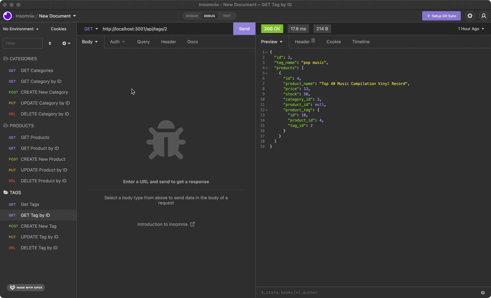

# E-Commerce Backend 

## Description
This app is designed to show off the routes that goes into making a backend web app. Routes are just part of the many tech components that make this possible!

## Table of Contents
* [Description](#description)
* [Demo](#demo)
* [Installation](#installation)
* [Technology](#technology)
* [Questions](#questions)

## Demo
https://watch.screencastify.com/v/1csGRtH56RcK0CUHtdxy

<figcaption align="center">Demonstration inside of Insomnia</figcaption>

## Installation
This project will require you to use npm, SQL, and insomnia. 

* Create a `.env` and put your SQL information to proceed
* Run the schemea provided within `/db/schema.sql` in your SQL shell or workbench
* Install the npm packages with: `npm install`
* Seed the database with this command: `npm run seed`
* Run the server with: `npm start`
* Open Insomnia or your browser, and navigate to `http://localhost:3001/` to see it running!

## Technology
* Javascript
* Node
* NPM
* SQL
* Insomnia
* Express.js
* Dotenv
* Sequalize

## Questions
For questions, reach me at my github: https://github.com/kh288